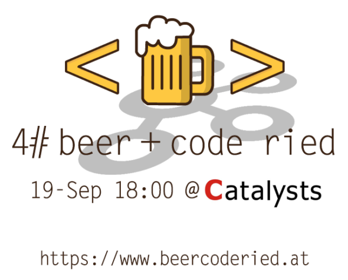

    

# Apache Spring Live Demo

Presented at **4# beer+code ried** on 19-Sep 18:00 @

## Covered Apache Kafka topics

### 1. Spring Boot Kafka Setup

Maven Dependencies for Spring Boot + Apache Kafka

Commit [#2900752](https://github.com/daviian/kafka-spring-live-demo/commit/2900752ba6cadfa92c2d878c77b39ec7de7d1dbc)

### 2. Producers + REST API

Topic Creation; Producer + KafkaTemplate; Spring REST API

Commit [#4eac5d1](https://github.com/daviian/kafka-spring-live-demo/commit/4eac5d1fe7da114f04e0d3f0dc110cb32cbc320f)

### 3. Consumers

Consumer + Configuration

Commit [#10de768](https://github.com/daviian/kafka-spring-live-demo/commit/10de7689fcf702dc205dbd4b6c34a90d07f68e10)

### 4. State Stores

First Stream + Stream Config; State Stores

Commit [#004021e](https://github.com/daviian/kafka-spring-live-demo/commit/004021e90e08c5d470c26c556dd1a6519fb1f82c)

### 5. Stream Joins

Stream Joins

Commit [#650c936](https://github.com/daviian/kafka-spring-live-demo/commit/650c936e09be308c19824fb1384889c9a6bf05e8)

### 6. Stream Aggregations

Stream Aggregation

Commit [#ad0f45f](https://github.com/daviian/kafka-spring-live-demo/commit/ad0f45f27b5093aceaa6e151b097ea357)

## HowTo use this project

1. Download https://github.com/confluentinc/cp-docker-images/tree/5.1.3-post
2. Run `docker-compose up -d --build` in `examples/cp-all-in-one`
3. Install [Kafkatool](http://www.kafkatool.com/) to inspect topics. The features we need are free. You don't have to purchase a license ;-)
4. Build and run the project
